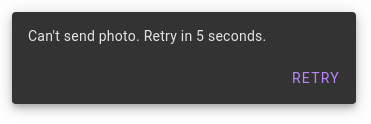

# `<mwc-snackbar>` [](https://www.npmjs.com/package/@material/mwc-snackbar)

> IMPORTANT: The Material Web Components are a work in progress and subject to
> major changes until 1.0 release.

Snackbars provide brief messages about app processes at the bottom of the
screen.


[Material Design Guidelines: Snackbars](https://material.io/design/components/snackbars.html)

[Demo](https://material-components.github.io/material-components-web-components/demos/snackbar/)

## Installation

```sh
npm install @material/mwc-snackbar
```

> NOTE: The Material Web Components are distributed as ES2017 JavaScript
> Modules, and use the Custom Elements API. They are compatible with all modern
> browsers including Chrome, Firefox, Safari, Edge, and IE11, but an additional
> tooling step is required to resolve *bare module specifiers*, as well as
> transpilation and polyfills for IE11. See
> [here](https://github.com/material-components/material-components-web-components#quick-start)
> for detailed instructions.

## Example usage

### Standard


```html
<mwc-snackbar id="photoErrorSnackbar"
              labelText="Can't send photo. Retry in 5 seconds.">
</mwc-snackbar>

<script type="module">
  import '@material/mwc-snackbar';
  const snackbar = document.querySelector('#photoErrorSnackbar');
  sendPhoto.then(...).catch(() => snackbar.show());
</script>
```

### Optional action and dismiss button


```html
<mwc-snackbar labelText="Can't send photo. Retry in 5 seconds.">
  <mwc-button slot="action">RETRY</mwc-button>
  <mwc-icon-button icon="close" slot="dismiss"></mwc-icon-button>
</mwc-snackbar>
```

### Custom action button color


```css
mwc-snackbar {
  --mdc-snackbar-action-color: #64dc17;
}
```

## Variants

### Stacked

Action buttons with long text should be positioned below the label instead of
alongside it. Set the `stacked` attribute or property to enable this layout.



### Leading

By default, snackbars are centered horizontally within the viewport. On larger
screens, they can optionally be displayed on the leading edge of the screen
(the left side in LTR, or the right side in RTL). Set the `leading`
attribute or property to enable this layout.

## API

### Slots

| Name      | Description
| --------- | -----------
| `action`  | Optional `<mwc-button>` which closes the snackbar with reason `'action'`.
| `dismiss` | Optional `<mwc-icon-button>` which closes the snackbar with reason `'dismiss'`.

### Properties/Attributes

| Name                | Type                  | Description
| ------------------- | --------------------- |------------
| `open`              | `boolean`             | Whether the snackbar is currently open.
| `timeoutMs`         | `number`              | Automatic dismiss timeout in milliseconds. Value must be between `4000` and `10000`  (or `-1` to disable the timeout completely) or an error will be thrown. Defaults to `5000` (5 seconds).
| `closeOnEscape`     | `boolean`             | Whether the snackbar closes when it is focused and the user presses the ESC key. Defaults to `false`.
| `labelText`         | `string`              | The text content of the label element.
| `stacked`           | `boolean`             | Enables the *stacked* layout (see above).
| `leading`           | `boolean`             | Enables the *leading* layout (see above).

### Methods

| Name     | Description
| -------- | -------------
| `show() => void`   | Opens the snackbar.
| `close(reason: string = '') => void` | Closes the snackbar, optionally with the specified reason indicating why it was closed.

### Events

| Name                  | Detail              | Description
| --------------------- | ------------------- | -----------
| `MDCSnackbar:opening` | `{}`                | Indicates when the snackbar begins its opening animation.
| `MDCSnackbar:opened`  | `{}`                | Indicates when the snackbar finishes its opening animation.
| `MDCSnackbar:closing` | `{reason?: string}` | Indicates when the snackbar begins its closing animation. `reason` contains the reason why the snackbar closed (`'dismiss'`, `'action'`, or a custom `string` via the `close` method).
| `MDCSnackbar:closed`  | `{reason?: string}` | Indicates when the snackbar finishes its closing animation. `reason` contains the reason why the snackbar closed (`'dismiss'`, `'action'`, or a custom `string` via the `close` method).

### CSS Custom Properties

| Name                          | Default | Description
| ----------------------------- | ------- |------------
| `--mdc-snackbar-action-color` |  `#bb86fc` | Color of the action button text.

#### Global CSS Custom Properties

This component exposes the following global [theming](https://github.com/material-components/material-components-web-components/blob/master/docs/theming.md)
custom properties.

| Name                                 | Description
| ------------------------------------ | -----------
| `--mdc-typography-body2-<PROPERTY>`  | Styles the typography of a snackbar.

## Additional references

- [MDC Web Snackbars](https://material.io/develop/web/components/snackbars/)
