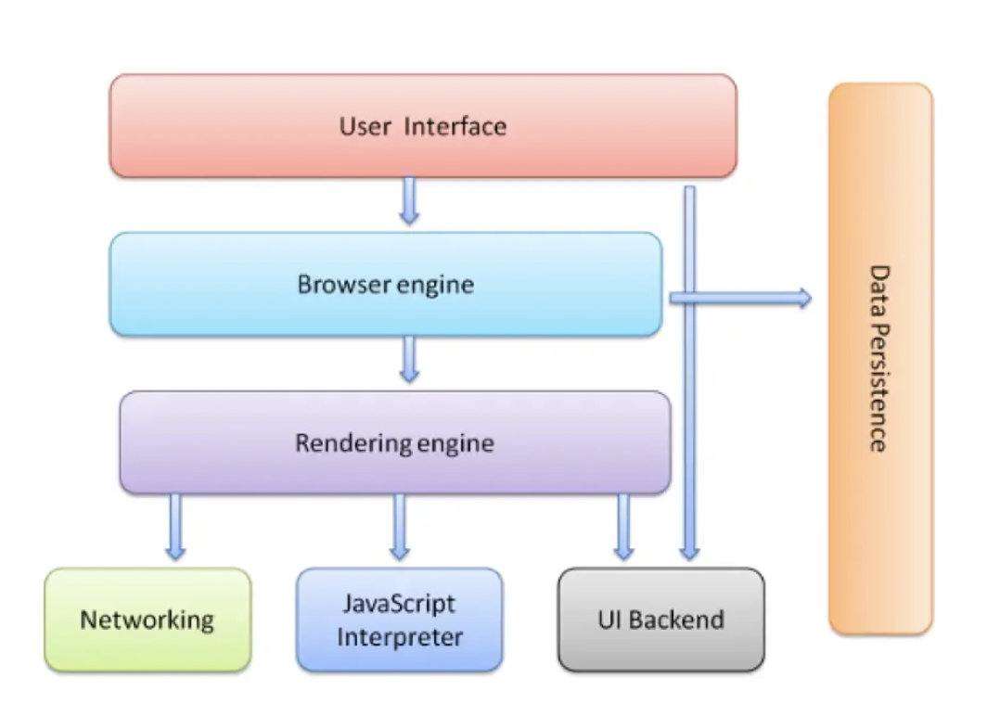
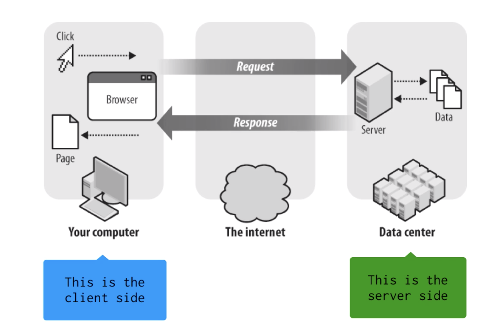

# VIDEO 1 - BROWSER AND BOM LECTURE

Document Object Model (DOM)
- hierarchy of objects in the document object
- includes HTML elements
- all elements of doc defined as objects (tree nodes)
	- come with predfined methods and properties
	- wll be learning all about these in coming days

Browser Object Model (BOM)
- larger representation of everything provided by the browser 
- includes the current document, location, history, frames, and any other functionality the browser may expose to JavaScrip
- window object (chief browser object)
	- global object, contains everything else

The Browser Diagram:

1. User Interface
   - what users interact with
	 - address bar, back/forward buttons, bookmarks, etc.
	 - everything except page content

2. Browser Engine
	 - manages interactions between UI and rendering engine

3. Render Engine
	 - displays requested page content
	 - parses HTML and CSS and renders parsed content
	 - not all browsers use same rendering engnie
	 	 - this is why things look different
		 - chrome (Blink), safari (Webkit)
	 - constructs DOM (obj rep of document tree)

4. Networking
	- handles network calls like HTTP req
	- asking for images, docs, that make up page

5. Javascript Interpreter
	 - parses and executes JS code (v8)

6. UI Backend
	 - used for drawing basic widgets

7. Data Storage
	 - persistence of data in browser (i.e cookies, web storage)
	 - retains state when pages refreshes
	 - cookies vs web storage
		 - Cookies can be read by the server as well as the client. 
		 - Web storage data can be read only client-side.

# VIDEO 2 - REQUEST/RESPONSE CYCLE

Overview
- browsing web is series of req and res
- request: searching for info or navigating to page
- response: what we expect to receive from req

Request / Response Cycle Diagram

1. Client Side (browser)
	 - what user interacts with

2. Internet
	 - series of client req and server responses

3. Server side 
	 - handles req and sends res
	 - more on this later

The role of the browser
- used to make req to server
	- can view req/res in Network Tab of Developer Tools
- parses HTML, CSS, JS
- renders info to user by constructing & rendering DOM tree

# VIDEO 3 - WINDOW OBJECT LECTURE

Scripts overview
- browser loads HTML top down 
- if it comes accross script:
	- must wait until script downloads & executes before processing rest of page
	- scripts have longer processing time than html

Script placement issues
1. scripts cant see DOM els below thme so they cant add handlers
2. if bulky script is at top of page, it "blocks the page"
	 - users cant see page content till script runs

Workarounds
1. place script at bottom of page
	 - browser sees script only after full html doc is downloaded
	 - for long html docs, may be noticaeble delay
2. `defer` attribute
	 - tells browser to load script in background
	 - doesnt block html from loading
	 - execute script when DOM is ready (before DOMContentLoaded event)
	 - only for external scripts (with src attrib)
	 - scripts still execute in order
	 - "document order"
3. `async` attributee
	 - script is independent
	 - doesnt block html from loading
	 - async scripts dont wait for eachother
	 	 - small script will run before large even if placed after large
		 - DOMContentLoaded may execute before or after
	 - "load first order"
4. can use both to cover all bases
	 - older browsers may not support `defer` 

# VIDEO 4 - BROWSER COOKIES

Cookies
- small piecese of info websites store on your computer
- stored and managed by web browser
- websites can only look at their own cookies

"good" cookie uses
- store login state (session token)
- store website preferences
- personalized content (cart, items you view)

"bad" cookie uses
- advertising/tracking networks can track youa cross web
- multiple websites might use trackign scripts from same advertising network

managing your cookies
- can clear cookies but you'll be logged out of sites you use