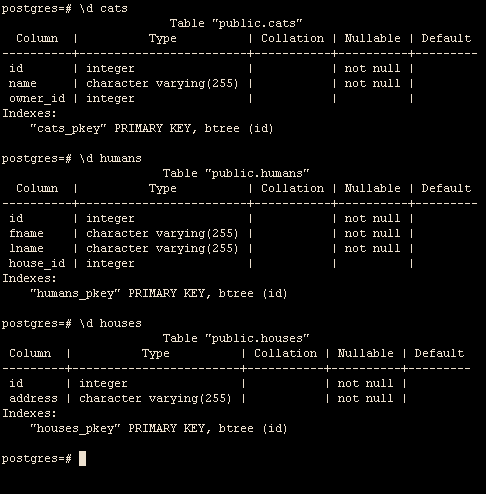

postgres=# \l
                                 List of databases
   Name    |  Owner   | Encoding |  Collate   |   Ctype    |   Access privileges
-----------+----------+----------+------------+------------+-----------------------
 bryan     | bryan    | UTF8     | en_US.utf8 | en_US.utf8 |
 catsdb    | cat      | UTF8     | en_US.utf8 | en_US.utf8 |
 postgres  | postgres | UTF8     | en_US.utf8 | en_US.utf8 |
 template0 | postgres | UTF8     | en_US.utf8 | en_US.utf8 | =c/postgres          +
           |          |          |            |            | postgres=CTc/postgres
 template1 | postgres | UTF8     | en_US.utf8 | en_US.utf8 | =c/postgres          +
           |          |          |            |            | postgres=CTc/postgres
 travel    | bryan    | UTF8     | en_US.utf8 | en_US.utf8 |
(6 rows)

Our Preexisting Database Schema
We are assuming that we are working with a preexisting SQL database. Our catsdb has a single table: Cats. Using the psql command-line program, we can describe the pre-existing Cats table below.

catsdb=> \d "Cats"
                                         Table "public.Cats"
    Column    |           Type           | Collation | Nullable |              Default
--------------+--------------------------+-----------+----------+------------------------------------
 id           | integer                  |           | not null | nextval('"Cats_id_seq"'::regclass)
 firstName    | character varying(255)   |           |          |
 specialSkill | character varying(255)   |           |          |
 age          | integer                  |           |          |
 createdAt    | timestamp with time zone |           | not null |
 updatedAt    | timestamp with time zone |           | not null |
Indexes:
    "Cats_pkey" PRIMARY KEY, btree (id)

postgres=# CREATE TABLE cats (
postgres(#   id INTEGER PRIMARY KEY,
postgres(#   name VARCHAR(255) NOT NULL,
postgres(#   owner_id INTEGER
postgres(# );
CREATE TABLE
postgres=# CREATE TABLE humans (
postgres(#   id INTEGER PRIMARY KEY,
postgres(#   fname VARCHAR(255) NOT NULL,
postgres(#   lname VARCHAR(255) NOT NULL,
postgres(#   house_id INTEGER
postgres(# );
CREATE TABLE
postgres=# CREATE TABLE houses (
postgres(#   id INTEGER PRIMARY KEY,
postgres(#   address VARCHAR(255) NOT NULL
postgres(# );
CREATE TABLE

postgres=# INSERT INTO humans (id, fname, lname, house_id)
postgres-# VALUES (1, 'Devon', 'Watts', 1),
postgres-#     (2, 'Matt', 'Rubens', 1),
postgres-#     (3, 'Ned', 'Ruggeri', 2),
postgres-#     (4, 'Catless', 'Human', NULL);
INSERT 0 4
postgres=#

postgres=# INSERT INTO cats (id, name, owner_id)
postgres-# VALUES (1, 'Breakfast', 1),
postgres-#     (2, 'Earl', 2),
postgres-#     (3, 'Haskell', 3),
postgres-#     (4, 'Markov', 3),
postgres-#     (5, 'Stray Cat', NULL);
INSERT 0 5
postgres=#
