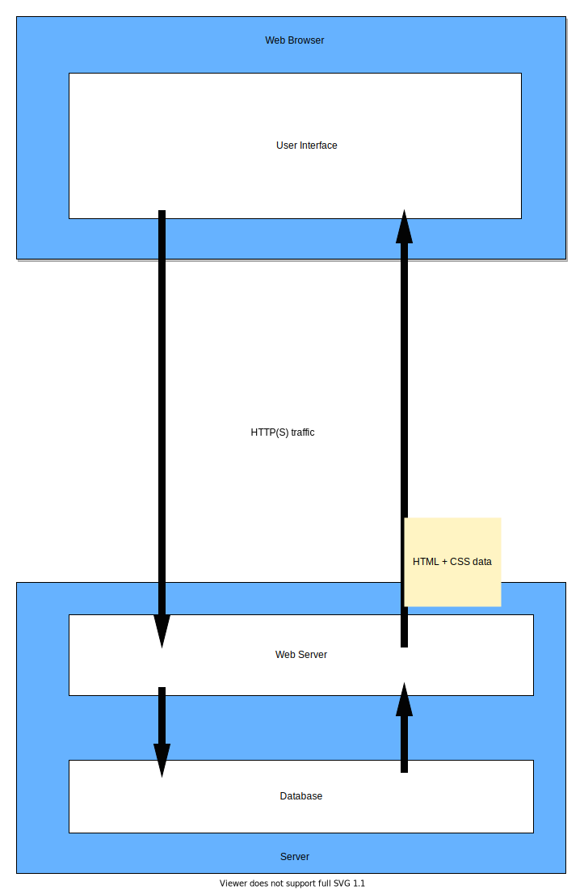
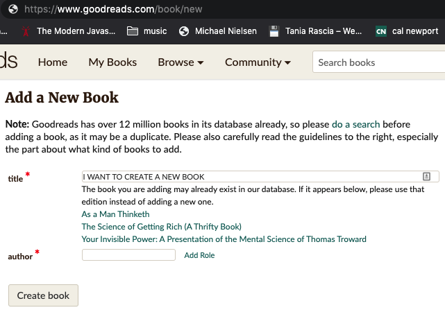
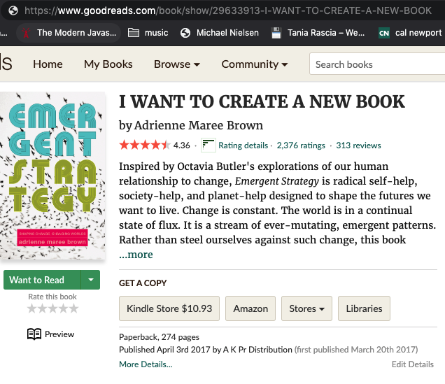

# AJAX: Paving the Road to the Modern Web
________________________________________________________________________________
<!-- @import "[TOC]" {cmd="toc" depthFrom=2 depthTo=6 orderedList=false} -->

<!-- code_chunk_output -->

- [Classic Full Page Reloads](#classic-full-page-reloads)
- [AJAX at a high level](#ajax-at-a-high-level)
- [Asynchronous JavaScript and XML](#asynchronous-javascript-and-xml)
  - [Asynchronous](#asynchronous)
  - [JavaScript](#javascript)
  - [XML](#xml)
- [Notes on AJAX](#notes-on-ajax)
- [What you've learned](#what-youve-learned)

<!-- /code_chunk_output -->
________________________________________________________________________________

In this lesson, you'll learn about AJAX (Asynchronous JavaScript and XML), which
is a set of technologies that allow for efficient client (web browser) and
server interaction. You'll first learn about the pre-AJAX approach that required
full page reloads whenever the client and server interacted. Then, you'll get an
overview of how AJAX works to make the client-server interaction much more
efficient.

## Classic Full Page Reloads

In the early days of the Web, most websites were fairly simple. When you land on
a website, the web browser would make requests to a server, and the server would
send back an entire HTML page for the browser to load:



This made sense for simple features. For example, let's say you were on a
website like Goodreads and wanted to create a new book:



Once you submit this form, the server will add a new record to the database, and
then redirect you to the page for that newly-created book:



When you arrive on that page, you get an entirely new HTML page from the server,
and your browser loads it up.

Back in the early days of the Web, this kind of flow sufficed. However, as
websites progressively got more interactive, this approach became inefficient
and insufficient. For example, let's imagine that you're on that book's show
page above, and all you wanted to do was hit the `Want to Read` button. Using
the old approach, here's what would happen:

1. You submit a request to the server to mark that specific book as "Want
   To Read".
2. The server would make the necessary changes to the database.
3. The server prepares the entire HTML page for this book, except this time it
   would render 'Want To Read' under the book image in that HTML document so
   that the user can see the updated status of the book.
4. Finally, your browser would load up the entire newly-received HTML document
   just to show the change in status:


## AJAX at a high level

You'll get a more in-depth explanation of how AJAX works in the next reading,
but at a high level, AJAX is a group of different technologies that work
together to allow a website to communicate with a server in the background
without requiring the website to reload in order to display new changes.

Specifically, the key difference with AJAX is that when a change happens, the
server is no longer responsible for updating the HTML and then sending the
entire HTML document back. Instead, the server would send back data about the
change, either in an XML or JSON format, and the website could then process that
data and update the DOM accordingly.

## Asynchronous JavaScript and XML

Let's use our Goodreads "Want to Read" example to break down the AJAX acronym.

### Asynchronous

Using AJAX, when the user hits the "Want to Read" button, the updates would now
happen asynchronously. In other words, the browser would interact with the
server in the background without blocking any other events from happening on the
web page.

### JavaScript

JavaScript is the engine behind AJAX. When the user hits the "Want to Read"
button, JavaScript is used to make the request to the server. When the data
comes back from the server, JavaScript can also then be used to make the
necessary updates to the DOM. In the next reading, we'll go more in-depth into
the specifics of how JavaScript is used.

### XML

The XML portion of this acronym is outdated. In the early days of AJAX, after
successfully updating the book's status to "Want To Read", the server would send
back data in XML format, like so:

```xml

  <?xml version="1.0" encoding="UTF-8"?>
  <book>
    <id>29633913</id>
    <status>Want To Read</status>
  </book>

```

Nowadays, XML has been largely replaced by JSON, and in this course, you will
almost always be dealing with a JSON response from a server that might look like
this:

```json
{
  "book": {
    "id": 29633913,
    "status": "Want to Read"
  }
}
```

## Notes on AJAX

As you can see, using AJAX requires a bit more complexity than the old
client-server approach. The payoff is an improved user experience: updating just
part of the page is almost always quicker than reloading the entire page.

Additionally, AJAX allows you to keep the user in their current context. For
example, the user doesn't lose their current position on the page since there's
no longer a full page reload.

Over time, JavaScript libraries have emerged that made using AJAX easier (i.e.
jQuery, client side templating libraries, etc.) Eventually, AJAX led to the
development of Single Page Applications, websites that have one and only one
HTML page. You'll learn much more about Single Page Applications once you get to
the React portion of this curriculum!

## What you've learned

So far, you've mainly looked at AJAX from a high level, but at this point, you
should have a clear understanding of:

- what AJAX is and the advantages of using AJAX
- what each letter of AJAX stands for and why

In the next lesson, we'll do a deeper dive into each step of AJAX.
