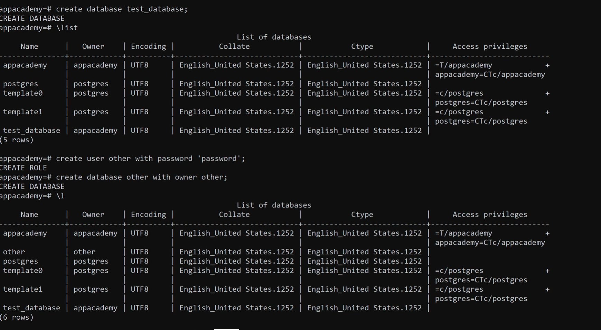
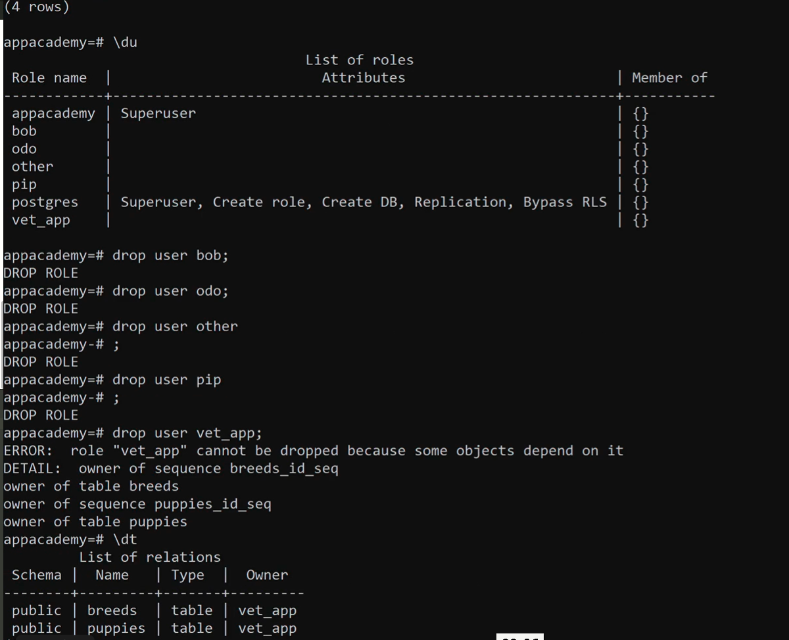
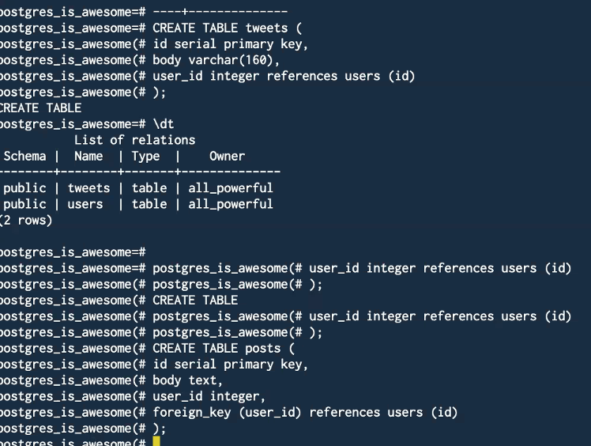

RDBMS
-----

That's quite an ugly acronym, but it's what developers have when referring to the software application that manages databases for us. Here's an important difference for you to understand.

The **RDBMS** is a software application that you run that your programs can connect to that they can store, modify, and retrieve data. The RDBS that you will use in this course is called [PostgreSQL](https://www.postgresql.org/ ), often shortened to just "postgres", pronounced like it's spelled. It is an "open-source" RDBMS which means that you can go read the source code for it, copy it, modify it, and make your own specialized version of an RDBMS. Often, developers will talk about the "database server". That is the computer on which the RDBMS is running.

A **database** (or more properly **relational database**) is a collection of structured data that the RDBMS manages for you. A single running RDBMS can have hundreds of databases in it that it manages.

What is PostgreSQL?
-------------------

Again, PostgreSQL is software. Specifically, it is an open-source, relational database management system. It is derived from the POSTGRES package written at UC Berkeley. The specific name "PostgreSQL" was coined in 1996, after SQL was implemented as its core query language. PostgreSQL provided a new program (new for 1996) for interactive SQL queries called `[psql]`, which is terminal-based front-end to PostgreSQL that lets you to type in queries interactively, issue them to PostgreSQL, and see the query results.


When you do connect with it, you will interact with it through a small set of its own commands and SQL.

What is SQL?
------------

SQL (pronounced "sequel" or "s-q-l") stands for "Structured Query Language". It is not a programming language like JavaScript. JavaScript, as you well know, has _control flow_, with `for` loops and `if` statements. Most SQL that you write doesn't have all that. Instead, it is a _declarative_ programming language. You tell the database what computation you want it to do, and it does it.


The process of using SQL takes two steps:

1.  Connect to an RDBMS specifying
    *   credentials, user name and password
    *   the name of the database that you want to use
2.  Issue one or more SQL statements to interact with
    *   the structure of the database
    *   the data in the database






##  PSQL


Magic words:
```bash
psql -U postgres
```
Some interesting flags (to see all, use `-h` or `--help` depending on your psql version):
- `-E`: will describe the underlaying queries of the `\` commands (cool for learning!)
- `-l`: psql will list all databases and then exit (useful if the user you connect with doesn't has a default database, like at AWS RDS)

Most `\d` commands support additional param of `__schema__.name__` and accept wildcards like `*.*`

- `\q`: Quit/Exit
- `\c __database__`: Connect to a database
- `\d __table__`: Show table definition (columns, etc.) including triggers
- `\d+ __table__`: More detailed table definition including description and physical disk size
- `\l`: List databases
- `\dy`: List events
- `\df`: List functions
- `\di`: List indexes
- `\dn`: List schemas
- `\dt *.*`: List tables from all schemas (if `*.*` is omitted will only show SEARCH_PATH ones)
- `\dT+`: List all data types
- `\dv`: List views
- `\dx`: List all extensions installed
- `\df+ __function__` : Show function SQL code.
- `\x`: Pretty-format query results instead of the not-so-useful ASCII tables
- `\copy (SELECT * FROM __table_name__) TO 'file_path_and_name.csv' WITH CSV`: Export a table as CSV
- `\des+`: List all foreign servers
- `\dE[S+]`: List all foreign tables

User Related:
- `\du`: List users
- `\du __username__`: List a username if present.
- `create role __test1__`: Create a role with an existing username.
- `create role __test2__ noinherit login password __passsword__;`: Create a role with username and password.
- `set role __test__;`: Change role for current session to `__test__`.
- `grant __test2__ to __test1__;`: Allow `__test1__` to set its role as `__test2__`.
- `\deu+`: List all user mapping on server

##  Configuration


- Service management commands:
```
sudo service postgresql stop
sudo service postgresql start
sudo service postgresql restart
```

- Changing verbosity & querying Postgres log:
  <br/>1) First edit the config file, set a decent verbosity, save and restart postgres:
```
sudo vim /etc/postgresql/9.3/main/postgresql.conf

# Uncomment/Change inside:
log_min_messages = debug5
log_min_error_statement = debug5
log_min_duration_statement = -1

sudo service postgresql restart
```
  2) Now you will get tons of details of every statement, error, and even background tasks like VACUUMs
```
tail -f /var/log/postgresql/postgresql-9.3-main.log
```
  3) How to add user who executed a PG statement to log (editing `postgresql.conf`):
```
log_line_prefix = '%t %u %d %a '
```

##  Create command


There are many `CREATE` choices, like `CREATE DATABASE __database_name__`, `CREATE TABLE __table_name__` ... Parameters differ but can be checked [at the official documentation](https://www.postgresql.org/search/?u=%2Fdocs%2F9.1%2F&q=CREATE ).


##  Handy queries

- `SELECT * FROM pg_proc WHERE proname='__procedurename__'`: List procedure/function
- `SELECT * FROM pg_views WHERE viewname='__viewname__';`: List view (including the definition)
- `SELECT pg_size_pretty(pg_total_relation_size('__table_name__'));`: Show DB table space in use
- `SELECT pg_size_pretty(pg_database_size('__database_name__'));`: Show DB space in use
- `show statement_timeout;`: Show current user's statement timeout
- `SELECT * FROM pg_indexes WHERE tablename='__table_name__' AND schemaname='__schema_name__';`: Show table indexes
- Get all indexes from all tables of a schema:
```sql
SELECT
   t.relname AS table_name,
   i.relname AS index_name,
   a.attname AS column_name
FROM
   pg_class t,
   pg_class i,
   pg_index ix,
   pg_attribute a,
    pg_namespace n
WHERE
   t.oid = ix.indrelid
   AND i.oid = ix.indexrelid
   AND a.attrelid = t.oid
   AND a.attnum = ANY(ix.indkey)
   AND t.relnamespace = n.oid
    AND n.nspname = 'kartones'
ORDER BY
   t.relname,
   i.relname
```
- Execution data:
  - Queries being executed at a certain DB:
```sql
SELECT datname, application_name, pid, backend_start, query_start, state_change, state, query
  FROM pg_stat_activity
  WHERE datname='__database_name__';
```
  - Get all queries from all dbs waiting for data (might be hung):
```sql
SELECT * FROM pg_stat_activity WHERE waiting='t'
```
  - Currently running queries with process pid:
```sql
SELECT pg_stat_get_backend_pid(s.backendid) AS procpid,
  pg_stat_get_backend_activity(s.backendid) AS current_query
FROM (SELECT pg_stat_get_backend_idset() AS backendid) AS s;
```

Casting:
- `CAST (column AS type)` or `column::type`
- `'__table_name__'::regclass::oid`: Get oid having a table name

Query analysis:
- `EXPLAIN __query__`: see the query plan for the given query
- `EXPLAIN ANALYZE __query__`: see and execute the query plan for the given query
- `ANALYZE [__table__]`: collect statistics

Generating random data ([source](https://www.citusdata.com/blog/2019/07/17/postgres-tips-for-average-and-power-user/ )):
- `INSERT INTO some_table (a_float_value) SELECT random() * 100000 FROM generate_series(1, 1000000) i;`


##  Forign keys are what make databases relational...they reference atable and column in another table.





  ```bash


\___________________________________________________
bryan_dir:~_exitstatus:0 ====>

sudo vim /etc/postgresql/12/main/postgresql.conf
[sudo] password for bryan:

\___________________________________________________
bryan_dir:~_exitstatus:0 ====>

sudo service postgresql status
12/main (port 5432): down

\___________________________________________________
bryan_dir:~_exitstatus:3 ====>

sudo service postgresql stop
 * Stopping PostgreSQL 12 database server                                                                                       [ OK ]

\___________________________________________________
bryan_dir:~_exitstatus:0 ====>

sudo service postgresql start
 * Starting PostgreSQL 12 database server                                                                                       [ OK ]

\___________________________________________________
bryan_dir:~_exitstatus:0 ====>

sudo -u postgres psql
psql (12.5 (Ubuntu 12.5-0ubuntu0.20.04.1))
Type "help" for help.

postgres=# ALTER USER bryan SUPERUSER;
ERROR:  role "bryan" does not exist
postgres=# ALTER USER postgres SUPERUSER;
ALTER ROLE
postgres=# ALTER USER postgres WITH ENCRYPTED PASSWORD 'password'
postgres-#

bryan_dir:~_exitstatus:0 ====>

sudo service postgresql start
 * Starting PostgreSQL 12 database server                                                                                       [ OK ]

\___________________________________________________
bryan_dir:~_exitstatus:0 ====>

sudo -u postgres psql
psql (12.5 (Ubuntu 12.5-0ubuntu0.20.04.1))
Type "help" for help.

postgres=# CREATE USER test_superuser
postgres-# WITH
postgres-# PASSWORD
postgres-# 'test'
postgres-# SUPERUSER;
CREATE ROLE
postgres=# CREATE USER test_superuser
postgres-# WITH
postgres-# PASSWORD 'test'
postgres-# SUPERUSER;
ERROR:  role "test_superuser" already exists
postgres=# \q

\___________________________________________________
bryan_dir:~_exitstatus:0 ====>
  ```

> Now type the following command to connect to PostgreSQL with the newly-created user. It instructs the client to connect as the user "test_superuser" (-U test_superuser) to the database named "postgres" (postgres) and prompt for the password (-W) for the user.

```bash
bryan_dir:~_exitstatus:0 ====>

psql -W -U test_superuser postgres
Password:
psql: error: FATAL:  password authentication failed for user "test_superuser"
FATAL:  password authentication failed for user "test_superuser"

\___________________________________________________
bryan_dir:~_exitstatus:2 ====>

psql -W -U test_superuser postgres
Password:
psql (12.5 (Ubuntu 12.5-0ubuntu0.20.04.1))
SSL connection (protocol: TLSv1.3, cipher: TLS_AES_256_GCM_SHA384, bits: 256, compression: off)
Type "help" for help.

postgres=#


psql -W -U test_superuser postgres
Password:
psql (12.5 (Ubuntu 12.5-0ubuntu0.20.04.1))
SSL connection (protocol: TLSv1.3, cipher: TLS_AES_256_GCM_SHA384, bits: 256, compression: off)
Type "help" for help.

postgres=# SELECT CURRENT_USER;
  current_user
----------------
 test_superuser
(1 row)

postgres=#


 test_superuser
(1 row)

postgres=# CREATE USER test_normal_user
postgres-# WITH
postgres-# PASSWORD 'test'
postgres-# ;
CREATE ROLE
postgres=# \q

\___________________________________________________
bryan_dir:~_exitstatus:0 ====>

psql -U test_normal_user -W postgres
Password:
psql: error: FATAL:  password authentication failed for user "test_normal_user"
FATAL:  password authentication failed for user "test_normal_user"

\___________________________________________________
bryan_dir:~_exitstatus:2 ====>

psql -U test_normal_user -W postgres
Password:
psql (12.5 (Ubuntu 12.5-0ubuntu0.20.04.1))
SSL connection (protocol: TLSv1.3, cipher: TLS_AES_256_GCM_SHA384, bits: 256, compression: off)
Type "help" for help.

postgres=> SELECT CURRENT_USER;
   current_user
------------------
 test_normal_user
(1 row)

postgres=> CREATE USER hacking_the_planet WITH PASSWORD 'pwned';
ERROR:  permission denied to create role
postgres=>


```
## Removing a user:


